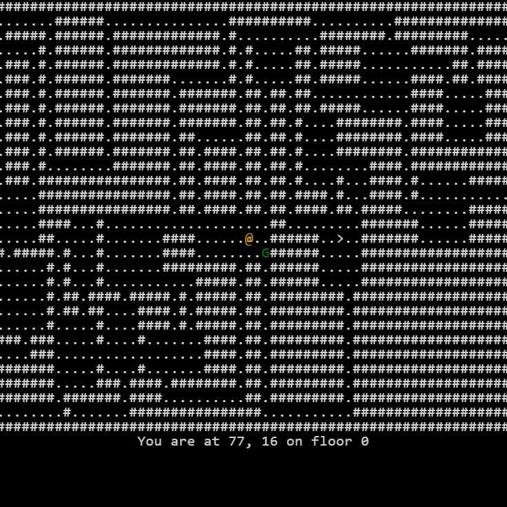

# Delver

A portable web-based roguelike game built with TypeScript, rot.js, and tested with Jest. 

## To do

- [x] Basic actors, props, and tiles 
- [x] Map generation 
- [x] Display 
- [x] Drawing text 
- [x] Player movement 
- [x] Traversal between floors 
- [ ] Player field of view 
- [ ] Simple combat
- [ ] Variety of NPC behaviors
- [ ] Item and equipment usage 

## Download and edit 

1. Clone the repository locally 
2. Run `npm install` to install required dependencies 
3. Review the developer commands listed below or in `package.json`
4. I recommend using the `npm run watchlive` command and editing some of the attributes in one of the `Actor` classes (`Player`, `Goblin`, etc.) 

## Download and play

Just a reminder that you can play Delver live [here](https://rckymntn.github.io/delver/), but if you'd prefer to play locally... 

1. Clone just the `dist` subdirectory 
2. Open `index.html` in your choice of web browser

or

1. Clone the repository locally 
2. Run `npm install` to install required dependencies 
3. Navigate to root folder and run the command `npm run live`

## Limitations

- Designed as a static site for GitHub Pages, so no saving player progress 

## Developer commands 

1. `npm run tests`: Runs the jest tests with coverage metrics located in `tests/`
2. `npm run build`: One time build the project to `dist/main.js`.
3. `npm run watch`: Build the project to `dist/main.js` on edits.
4. `npm run live`: Open the project on localhost.
5. `npm run watchlive`: Combination of `watch` and `live`. 
6. `npm run minify`: Minify `dist/main.js` to `dist/main.min.js`.